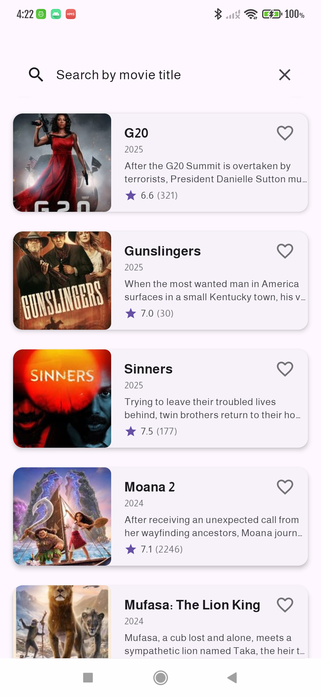
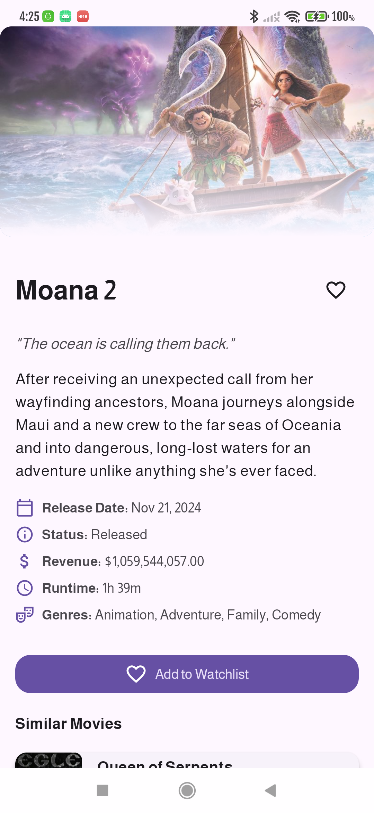
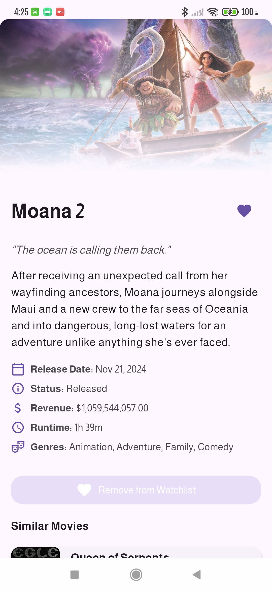
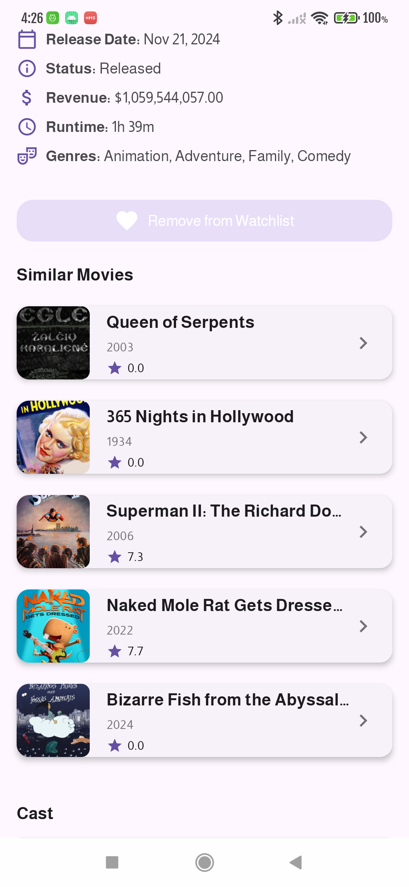
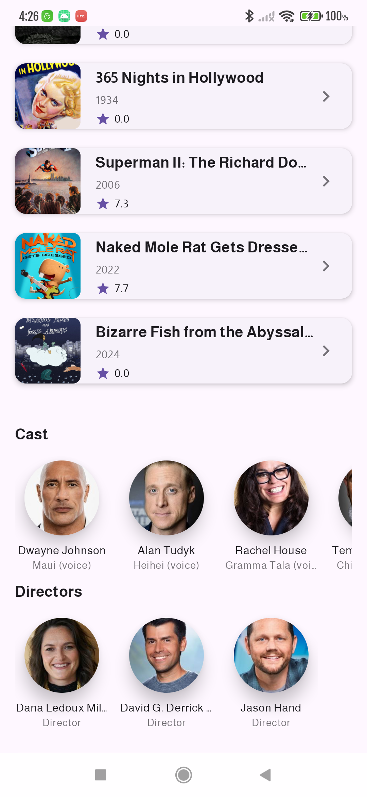
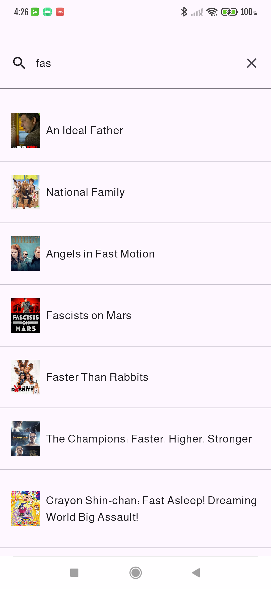

**Movie App v1.0 Release Notes**
June 2024 Release

🎬 New Features
1. Home Screen
Discover popular movies in a beautifully designed feed
Movies organized by release year with clean grouping
Each movie card displays:
    -   Poster image
    - Title & release year
    - Rating (with star icon)
    - Favorite status indicator

2. Powerful Search
Instant search as you type
Results update in real-time
Same rich movie cards as home screen
Empty state with helpful prompts

3. Movie Details
Comprehensive movie information:
High-quality backdrop image
Title, tagline, and overview
Release date, revenue, and status
Rating and vote count
Similar movies recommendations
Cast & crew section featuring:
Top 5 actors by popularity
Directors grouped separately

4. Favorites System
Heart icon to save/remove favorites
Persists between app sessions
Accessible from any screen
Visual confirmation on toggle

## Authors

* [Muhammad Ramadan](https://www.linkedin.com/in/m7mdramadandx/)

## Screenshots for the App

  

  

 
